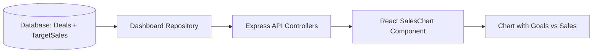

# 📊 Sales Chart Implementation (Monthly, Weekly, Yearly)

This document explains **how I implemented the Sales Chart** feature in my CRM project.  
The chart shows **actual sales revenue (Closed Won deals)** compared with **target goals** for **monthly, weekly, and yearly views**.

---

## 🔹 Step 1: Database Models

I created two key models using **Sequelize**:

### 1. `Deal`
Stores CRM deal information. Important fields:
- `deal_stage` → Tracks status (`Proposal Sent`, `Negotiation`, `Closed Won`, `Closed Lost`)
- `amount` → Revenue from the deal
- `close_date` → Used for grouping sales by month, week, or year

### 2. `TargetSales`
Stores **target goals** for each period:
- `period_type` → `'month' | 'week' | 'year'`
- `period_value` → Example: `"2025-01"`, `"Week 1"`, `"2025"`
- `target_amount` → Numeric goal value

This design allows me to compare **actuals vs targets** easily.

---

## 🔹 Step 2: Repository Functions

I implemented reusable queries in `DashBoardRepository`:

- **Monthly**
  - `totalAmountByMonth()` → SUM of `amount` for Closed Won deals, grouped by month
  - `eachMonthlyTarget()` → Fetches monthly target goals

- **Weekly**
  - `totalAmountByWeek()` → SUM of `amount` for Closed Won deals, grouped by week of current month
  - `eachWeeklyTarget()` → Fetches weekly target goals

- **Yearly**
  - `totalAmountByYear()` → SUM of `amount` for Closed Won deals, grouped by year (last 3 years + current)
  - `eachYearlyTarget()` → Fetches yearly target goals

👉 These functions make the backend modular and reusable.

---

## 🔹 Step 3: Backend Controllers

I built **three API endpoints**:

- `/api/v1/dashboard/sales/chart/monthly`
- `/api/v1/dashboard/sales/chart/weekly`
- `/api/v1/dashboard/sales/chart/yearly`

### Controller workflow
1. Fetch **sales data** from repository.
2. Fetch **target goals**.
3. Create a **goal map** for quick lookup.
4. Transform raw data into chart-friendly format:

```ts
{
  period: "Jan" | "Week 1" | "2024", 
  sales: number, 
  goal: number
}
```

### Example Responses
**Monthly**
```json
[
  { "period": "Jan", "sales": 4500, "goal": 7000 },
  { "period": "Feb", "sales": 2000, "goal": 4500 },
  { "period": "Mar", "sales": 3000, "goal": 6000 }
]
```

**Weekly**
```json
[
  { "period": "Week 1", "sales": 2000, "goal": 3000 },
  { "period": "Week 2", "sales": 4000, "goal": 5000 }
]
```

**Yearly**
```json
[
  { "period": "2022", "sales": 25000, "goal": 30000 },
  { "period": "2023", "sales": 35000, "goal": 40000 },
  { "period": "2024", "sales": 42000, "goal": 50000 }
]
```

---

## 🔹 Step 4: Frontend Integration (React + TypeScript)

I built a `SalesChart` component with the following steps:

1. **Dropdown for timeframe**
   ```tsx
   <select value={timeFrame} onChange={handleTimeFrameChange}>
     <option value="monthly">Monthly</option>
     <option value="weekly">Weekly</option>
     <option value="yearly">Yearly</option>
   </select>
   ```

2. **Dynamic API fetchers**
   ```ts
   const apiFetchers = {
     monthly: monthlySalesData,
     weekly: weeklySalesData,
     yearly: yearlySalesData,
   };
   ```

3. **Transform API response → chart bars**
   ```ts
   {
     label: item.period,      // "Jan", "Week 1", "2024"
     primary: item.sales,     // Actual sales
     secondary: item.goal,    // Goal
     total: item.goal         // For tooltip display
   }
   ```

4. **Render chart**
   - Goal → background bar (light purple)
   - Sales → foreground bar (dark purple)
   - Y-axis → scales dynamically based on max value
   - Tooltip → shows both Sales & Goal on hover

---

## 🔹 Step 5: Final Flow

1. User selects **Monthly/Weekly/Yearly**.
2. React calls respective API (`/monthly`, `/weekly`, `/yearly`).
3. Backend fetches:
   - Sales from `Deal`
   - Targets from `TargetSales`
4. Data is formatted into `{ period, sales, goal }`.
5. React renders chart with **dual bars**.

---

## ✅ Key Features Achieved

- 📌 Supports **three timeframes** (Monthly, Weekly, Yearly).  
- 📌 **Dynamic Y-axis scaling** based on data.  
- 📌 **Dual bar visualization** → Goal vs Sales.  
- 📌 **Reusable backend design** with repository + controllers.  
- 📌 **Maintainable frontend** with unified fetch logic.  

---

## 🔄 Data Flow Diagram



---

This is **how I implemented the Sales Chart feature** in my CRM dashboard. 🚀
